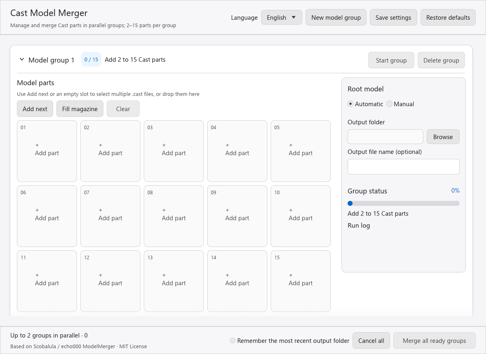
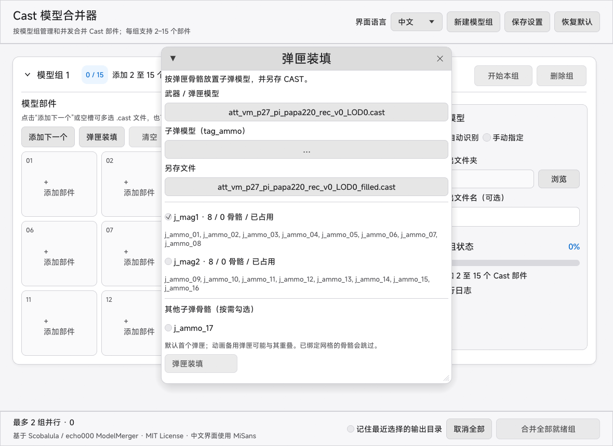
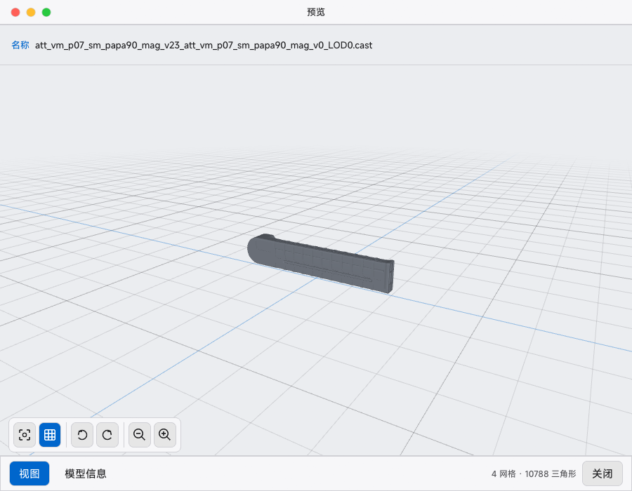
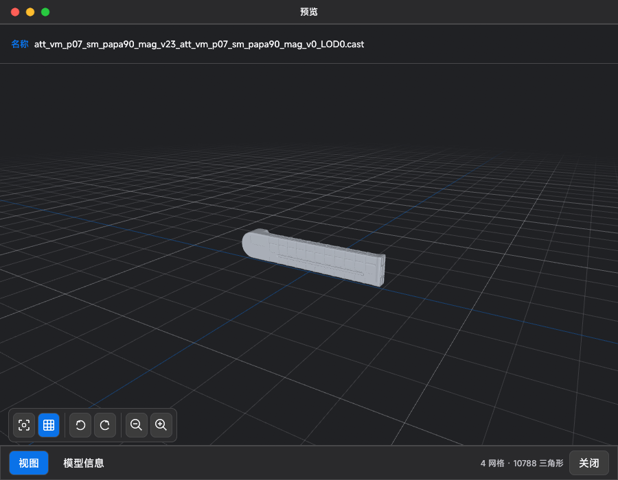

# Cast Model Merger GUI

[简体中文](README.md) | English

A Windows desktop tool based on [echo000/ModelMerger](https://github.com/echo000/ModelMerger). Manage multiple model groups and merge 2–15 Cast model parts per group into a single `.cast` file.

## Screenshots

### Main interface



### Magazine filling (v2.2.1)

The following feature screenshots show the Chinese interface. The application also supports English, French, Russian and Spanish.



### Model preview

Preview windows follow the application's light/dark theme, typography, rounded controls and colors. Neutral shading makes the model's shape easier to inspect.

| Light theme | Dark theme |
| --- | --- |
|  |  |

## Download

Following the full Rust migration, [Releases](https://github.com/ez4cywa/ModelMergerGUI/releases/latest) provide only the native Windows x64 portable edition.

| Edition | Download | Runtime requirements |
| --- | --- | --- |
| Rust-native portable | `CastModelMerger-win-x64.zip` | 64-bit Windows; **no .NET, Rust or additional runtime installation required** |

### System requirements

- 64-bit Windows 10 or 11. Windows 11 x64 with actively supported graphics drivers is recommended.
- A graphics driver supporting Direct3D 12. Rendering uses `wgpu`; if the application cannot create a window, update your Intel, AMD or NVIDIA graphics driver.
- No .NET Desktop Runtime or Rust installation is needed. Rust 1.96 is a source-build requirement only.

Extract the entire ZIP before running `CastModelMerger.exe`. The merge engine, application state, settings, localized interface and model preview are compiled into one native Rust application.

## Features

- Create independent merge groups and expand or collapse each one.
- Use a visual 5 × 3 slot grid with a selected-part count for each group.
- Click **Add next** or an empty slot to select multiple `.cast` files in one file-picker operation, or drag files into a group.
- Fixed-width part cards truncate long filenames. Hover to see the full path without squeezing the settings pane.
- Each group remembers its most recently used input folder for subsequent selections.
- Remove or replace parts and manually select a root model for each group.
- Open an interactive 3D preview of any imported part or the final merged model. Rust parses all previews, including models using 32-bit face indices.
- GPU depth-buffered rendering supports drag-to-rotate, wheel zoom, keyboard controls and view reset. Large previews are sampled without modifying source files.
- Fill magazine ammunition bones with copies of a cartridge model, and optionally select other numbered ammunition bones such as `j_ammo_17`.
- Start or cancel individual groups, or merge all ready groups at once.
- Run up to two merges concurrently; additional groups are queued. Queued and running jobs can both be cancelled.
- Prevent two model groups from writing to the same output path. Conflicts stop processing before mesh merging.
- Preserve the upstream root-detection, skeleton-connection and model-repositioning behavior by default.
- Choose an output folder and filename. Standard merging asks before overwriting an existing file; magazine filling always requires a new filename.
- Background processing, horizontal percentage progress bars, stage updates, logs and cancellation keep the interface responsive.
- Write output to a temporary file and read it back for validation before creating the final file.
- A fully native Rust architecture handles CAST parsing, merging, scheduling, settings, five-language UI and previews in one process. See the [full migration record (Chinese)](docs/full-rust-migration.md).
- Switch instantly between 中文, English, Français, Русский and Español. Existing state, logs and dialogs update with the selected language.
- Embedded MiSans for Chinese; Segoe UI for the other four interface languages.
- Open **About** in the top toolbar to view the version, visit the GitHub repository and downloads, report issues, copy the project link, and check credits and licenses. The dialog follows the current language and light/dark theme.
- Check GitHub updates manually in **About**, or opt into startup checks (off by default). Same-version package refreshes are detected; downloads require a click and the app is never replaced automatically.
- Copy a source magazine's local ammunition positions and rotations to spare magazines without placement bones. Spares are individually selected and unchecked by default; new ammunition follows its own magazine bones.
- Magazine output also supports Windows filesystems without hard links, while preserving the requirement to save to a new filename.
- Save the interface language, output folder, root-model mode and window position. Selected model paths are not persisted.

The original WPF and command-line projects remain in the source tree for compatibility reference but are no longer included in release packages. The Rust GUI accepts 2–15 `.cast` parts per merge group and produces read-back-validated `.cast` output.

Settings are stored at:

```text
%LocalAppData%\CastModelMerger\settings.json
```

If window or graphics-renderer initialization fails, a Chinese/English message offers access to the diagnostics folder. Startup crashes and preview decoding errors are logged at:

```text
%LocalAppData%\CastModelMerger\logs\CastModelMerger.log
```

## Usage

1. Click **New model group** to add a task. Collapse groups you do not need to view.
2. Click **Add next** or an empty slot in the target group and select one or more `.cast` files. Files fill the remaining slots in the order returned by the file picker.
3. Add 2–15 parts, or drag multiple files into the group. Files beyond the 15-part limit are not added, and a capacity notice is shown.
4. Click a part's **Preview** button to inspect it. Keep automatic root detection, or select manual root mode and use the part's set-as-root action.
5. Choose the group's output folder. Leave the output filename blank to use the root model's name.
6. Start the group or merge all ready groups using the bottom action bar. After a successful merge, preview the result from the group's status pane.

Use the language selector at the top right to switch languages. Click **Save settings** to keep that choice for the next launch. On first launch, the application follows Windows when its language is one of the five supported languages; otherwise it defaults to Chinese.

The Chinese interface embeds Xiaomi MiSans. MiSans is not covered by this project's MIT license; its use and distribution follow Xiaomi's font license. See [THIRD-PARTY-NOTICES.md](THIRD-PARTY-NOTICES.md) and the official license linked there.

The application uses a macOS-inspired layout, system light/dark themes and compact 36 px path/filename inputs. Main-window shortcuts: `Ctrl+N` creates a group, `Ctrl+S` saves settings, and `Ctrl+Enter` starts all ready groups.

## Fill ammunition at magazine bones (v2.2.1)

1. Click **Fill magazine** in any group's parts area. The tool prefers that group's merged output; you can also select a weapon or magazine CAST directly in the dialog.
2. Click the **Ammunition model** field and choose a cartridge CAST containing a single `tag_ammo` bone.
3. Wait for bone detection, then select the magazine groups to fill. Each group shows its bone count and occupied count. Only the first group is selected by default. Under **Other ammunition bones (optional)**, select individual locations such as `j_ammo_17`. You may deselect every magazine group and fill only these individual locations. Alternate animation magazines may overlap in the reference pose, so select them as needed.
4. Click **Save as** to choose an output file. The default is a `_filled.cast` file beside the weapon. Use a new filename; the original model is never overwritten.
5. Click **Fill magazine**. One cartridge instance is positioned, rotated and rigidly bound to each empty selected bone. Bones with existing mesh weights are skipped. After completion, click **Preview filled model**.

Detection recognizes `j_ammo_<digits>` and `tag_ammo_<digits>` beneath `j_mag`, `j_mag<digits>` or `tag_clip`. Counts come from the model's bones, not an assumed real-world weapon capacity. Numbered ammunition bones outside those subtrees are unchecked by default but can be selected individually.

Only unit-scale rigid skeletons are supported. Multi-bone cartridge sources, model-level transforms and non-unit bone scaling produce an error. One operation is limited to 512 slots and five million added vertices. See the [sample bone research (Chinese)](docs/ammo-bone-research.md).

## Preview models

### Preview a part

1. Click **Add next** or an empty slot and choose one or more `.cast` files.
2. Each imported part displays its filename and a **Preview** button.
3. Click **Preview** to open an independent 3D window.
4. Open additional previews to compare parts side by side.

### Preview a merged model

1. Add 2–15 valid parts and check the output folder, choosing a different folder if needed.
2. Start the group and wait for a successful merge.
3. Click the merged-model preview button in the group's status pane. It becomes available only after a successful merge while the output file still exists.
4. If you move or delete the output file, merge again before previewing it.

### Preview controls

| Action | Mouse or keyboard |
| --- | --- |
| Free rotation | Hold the left mouse button and drag |
| Step rotation | Use the rotate-left/right buttons or arrow keys |
| Zoom | Mouse wheel, zoom buttons, or `+` / `-` |
| Reset view | Reset-view button or `R` |
| Close preview | Close button or `Esc` |

Previewing is read-only: it does not change parts, merge plans or output files. Geometry is prepared once in the background; the GPU handles rotation, zoom, shading and occlusion. A preview displays at most 250,000 triangles and shows a notice when sampled. Merging still uses the full model data.

## Build and test

Building the Rust GUI requires Rust 1.96 or a compatible newer stable toolchain. Release users do not need Rust or .NET.

MiSans permits embedding in an application but not redistributing the font as a standalone resource, so `.ttf` files are not committed to this repository. Before your first source build, read the [official MiSans license](https://hyperos.mi.com/font/en/download/), then run the following if you accept it:

```powershell
.\scripts\Install-MiSans.ps1 -AcceptLicense
```

The script downloads and verifies Xiaomi's official font package and extracts only the Medium weight used by the application. Chinese heading hierarchy relies on size, color and spacing rather than synthetic bold. The local font file is ignored by Git and embedded in the release executable. Official releases already include the embedded font; end users do not need to run this script.

```powershell
cd .\rust
cargo clippy --workspace --all-targets -- -D warnings
cargo test --workspace
cargo build --release -p model-merger-gui --bin CastModelMerger
```

The CAST decoder enforces budgets for nodes, properties, numeric values and text. Windows CI checks formatting, Clippy, tests, release builds and icon resources, with scheduled weekly decoder fuzzing. After installing `cargo-fuzz`, you can also run the following from the `rust` directory:

```powershell
cargo fuzz --fuzz-dir .\fuzz run decode
```

From the repository root, create the native Windows x64 portable package and SHA-256 checksum file:

```powershell
.\scripts\Publish-RustNative.ps1
```

## Project structure

```text
rust/crates/cast-codec              Strictly bounded CAST encoding/decoding
rust/crates/model-merger-engine     Merging, ammunition placement, validation, safe output, preview sampling
rust/crates/model-merger-app-core   Workspace, settings, five-language catalogs, two-worker scheduling
rust/crates/model-merger-gui        Native eframe/egui/wgpu desktop interface
rust/fuzz                          CAST decoder fuzzing entry point
src/ and tests/                    Legacy WPF compatibility references and fixtures
```

The migration-era `model-merger-worker` source is retained as a historical protocol reference, but is excluded from the default Rust workspace and all production build, test and release paths.

## Credits and license

The original ModelMerger was developed by Philip / Scobalula, with Cast support added by echo000. This project retains the original attribution and uses the [MIT License](LICENSE).
