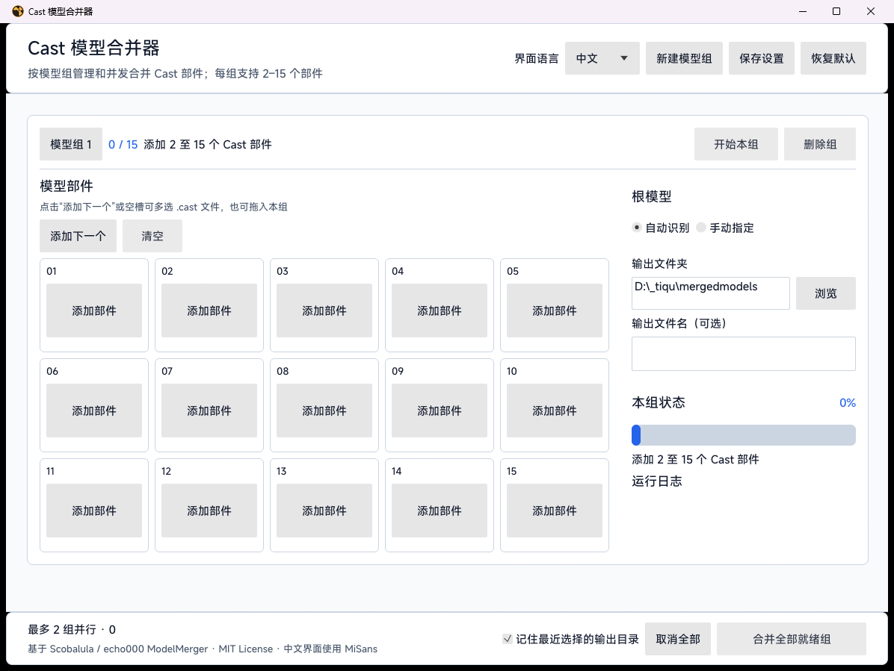

# Cast Model Merger GUI

一个基于 [echo000/ModelMerger](https://github.com/echo000/ModelMerger) 的 Windows 图形界面工具。可同时管理多个模型组，每组把 2 至 15 个 Cast 模型部件合并为一个 `.cast` 文件。

## 界面截图

| 中文主界面 | English UI |
| --- | --- |
|  |  |

### 模型预览


## 下载

全 Rust 迁移完成后，[Releases](https://github.com/ez4cywa/ModelMergerGUI/releases/latest) 只提供 Windows x64 原生免安装版：

| 版本 | 下载文件 | 运行环境 |
| --- | --- | --- |
| Rust 原生免安装版 | `CastModelMerger-win-x64.zip` | 64 位 Windows；**不需要 .NET、Rust 或其他额外运行环境** |

### 免安装版需要的环境

- 64 位 Windows 10/11；建议使用仍能获得显卡驱动更新的 Windows 11 x64。
- 支持 Direct3D 12 的显卡驱动。预览由 `wgpu` 渲染；如窗口无法创建，请先更新 Intel、AMD 或 NVIDIA 显卡驱动。
- 不需要安装 .NET Desktop Runtime，也不需要安装 Rust。Rust 1.96 仅是从源码构建时的工具链要求。

下载后请完整解压 ZIP，再运行 `CastModelMerger.exe`。合并引擎、应用状态、设置、多语言界面和模型预览均已编译进同一个 Rust 原生程序。

## 功能

- 可创建多个互相独立的合并组，每组均可展开或折叠。
- 每组提供 5 × 3 可视化槽位，清楚显示当前已选数量。
- 点击“添加下一个”或任一空槽位，可在系统文件选择器中一次选中多个 `.cast` 文件；也支持将多个文件拖入对应组。
- 部件卡片使用固定宽度，长文件名自动显示省略号；鼠标悬停可查看完整文件路径，不会挤压右侧设置区。
- 各组会记住最近添加部件的文件夹，后续选择会从同一路径打开。
- 支持删除、替换部件，并可为各组手动指定根模型。
- 可从任一已选槽位打开交互式 3D 部件预览，也可在合并完成后预览最终拼接模型；所有 Cast 预览均由 Rust 解析，包含使用 32 位面索引的模型。
- 预览窗口使用 GPU 深度缓冲渲染，支持鼠标拖动旋转、滚轮缩放、键盘操作和一键重置视角；大型模型会自动抽样显示，不修改源文件。
- 可单独启动、取消某一组，也可一键合并所有已就绪的组。
- 最多同时执行 2 组合并，其他组自动排队；排队或运行中的任务均可取消。
- 同一输出路径不会被两个模型组同时写入，冲突会在网格合并前停止。
- 默认沿用上游的根模型识别、骨骼连接和模型重定位逻辑。
- 可选择输出文件夹和输出文件名，覆盖已有文件前会确认。
- 后台合并、横向百分比进度条、阶段状态、运行日志及取消操作，界面不会因处理大模型而冻结。
- 输出先写入临时文件并重新读取验证，成功后才生成最终文件。
- 采用全 Rust 原生架构：CAST 解析、合并、任务调度、设置、五语界面和预览均在同一进程内完成；可查看[完整迁移记录](docs/full-rust-migration.md)。
- 中文、English、Français、Русский、Español 可在同一程序内即时切换，已有状态、日志和对话框会同步更新。
- 中文界面使用随程序嵌入的 MiSans，其他四种语言使用 Segoe UI。
- 可保存界面语言、输出目录、根模型模式及窗口位置；不会保存已选择的模型路径。

原 WPF 和命令行项目保留在源码树中作为兼容性对照，不再进入正式发布包。Rust GUI 只接受每组 2–15 个 `.cast` 部件，并输出经过重新读取验证的 `.cast` 文件。

设置文件保存在：

```text
%LocalAppData%\CastModelMerger\settings.json
```

如果程序在创建窗口或显卡渲染器时失败，会显示中英双语提示并可直接打开诊断目录。启动崩溃和预览解码错误记录在：

```text
%LocalAppData%\CastModelMerger\logs\CastModelMerger.log
```

## 使用

1. 使用“新建模型组”添加任务；不需要查看的组可以折叠。
2. 在目标组中点击“添加下一个”或任一空槽位，一次选择一个或多个 `.cast` 部件；文件会按选择器返回的顺序填入剩余槽位。
3. 重复添加，直到该组选择 2 至 15 个部件；也可以直接拖入多个文件。超过 15 个的部分不会加入，并会显示容量提示。
4. 点击已添加部件下方的“预览”，可在合并前检查单个部件；保持“自动识别”根模型，或切换到“手动指定”并在部件槽点击“设为根”。
5. 选择该组的输出文件夹；文件名可留空，此时使用根模型名称。
6. 点击组内“开始合并”，或点击底部“合并所有已就绪组”。成功后可在本组状态区预览合并模型。

界面右上角可随时选择中文、English、Français、Русский 或 Español；点击“保存设置”后，下次启动会沿用该语言。首次启动会跟随 Windows 的上述五种界面语言，其他系统语言默认显示中文。

中文界面嵌入并使用小米 MiSans 字体。MiSans 不属于本项目的 MIT 授权范围，使用和分发遵循小米的 MiSans 字体许可；详情见 [THIRD-PARTY-NOTICES.md](THIRD-PARTY-NOTICES.md) 和官方许可页面。

## 如何预览模型

### 预览单个部件

1. 在模型组中点击“添加下一个”或任一空槽位，选择一个或多个 `.cast` 文件。
2. 文件添加成功后，原来的空槽位会显示文件名和“预览”按钮。
3. 点击该槽位中的“预览”，即可打开独立的 3D 预览窗口。
4. 可以继续预览其他部件；每个预览窗口相互独立，允许同时打开多个窗口进行对比。

### 预览合并后的模型

1. 为模型组添加 2 至 15 个有效部件，并确认自动生成的输出文件夹；如有需要，也可以另选目录。
2. 点击“开始合并”，等待本组状态显示合并成功。
3. 在右侧“本组状态”区域点击“预览合并模型”。该按钮只有在合并成功且输出文件仍然存在时才会启用。
4. 如果移动或删除了输出文件，请重新合并后再预览。

### 预览窗口操作

| 操作 | 鼠标或键盘 |
| --- | --- |
| 自由旋转 | 按住鼠标左键拖动 |
| 分步旋转 | 点击“向左旋转”或“向右旋转”，也可使用方向键 |
| 放大或缩小 | 滚动鼠标滚轮、点击“放大/缩小”，或按 `+` / `-` |
| 恢复初始视角 | 点击“重置视角”或按 `R` |
| 关闭预览 | 点击“关闭”或按 `Esc` |

预览只读取模型，不会修改部件、合并计划或输出文件。几何在后台准备一次，旋转、缩放、明暗和遮挡由 GPU 完成。预览画面最多显示 250,000 个三角面；发生抽样时窗口会显示简化提示，但实际合并仍使用完整模型数据。

## 构建和测试

正式 Rust GUI 需要 Rust 1.96 或兼容的更新稳定工具链。发布包用户不需要安装 Rust 或 .NET。

MiSans 的许可允许把字体嵌入应用，但不允许把字体文件作为独立资源再次分发，因此 Git 仓库不直接提交 `.ttf`。首次从源码构建前，请阅读[官方 MiSans 许可](https://hyperos.mi.com/font/en/download/)，接受后运行：

```powershell
.\scripts\Install-MiSans.ps1 -AcceptLicense
```

脚本从小米官网下载经校验的字体包，只提取程序使用的 Medium 字重；中文标题层级通过字号、颜色和间距区分，避免合成粗体造成观感不一致。下载的本地字体文件会被 Git 忽略，Rust Release 编译时将其嵌入 EXE。官方 GitHub Release 已包含嵌入字体，普通用户无需运行该脚本。

```powershell
cd .\rust
cargo clippy --workspace --all-targets -- -D warnings
cargo test --workspace
cargo build --release -p model-merger-gui --bin CastModelMerger
```

CAST 解码器还提供节点、属性、数值和文本资源预算。仓库通过 Windows CI 检查格式、Clippy、测试、Release 构建和图标资源，并每周运行解码模糊测试；也可本地安装 `cargo-fuzz` 后执行：

```powershell
cargo fuzz --fuzz-dir .\fuzz run decode
```

生成项目唯一发布类型——不依赖 .NET 的 Rust 原生 Windows x64 免安装包，并同时生成 SHA-256 校验文件：

```powershell
.\scripts\Publish-RustNative.ps1
```

## 工程结构

```text
rust/crates/cast-codec              边界检查严格的 CAST 编解码
rust/crates/model-merger-engine     合并、验证、安全输出与预览抽样
rust/crates/model-merger-app-core   工作区、设置、五语目录与双并发调度
rust/crates/model-merger-gui        eframe/egui/wgpu 原生桌面界面
rust/fuzz                           CAST 解码器模糊测试入口
src/ 和 tests/                      迁移期间保留的 WPF 兼容性对照与语料
```

迁移期 `model-merger-worker` 源码仍保留用于历史协议对照，但已从默认 Rust workspace 和所有正式构建、测试、发布路径中排除。

## 致谢与许可

原始 ModelMerger 由 Philip / Scobalula 开发，Cast 支持由 echo000 添加。本项目保留原作者署名并继续采用 [MIT License](LICENSE)。
